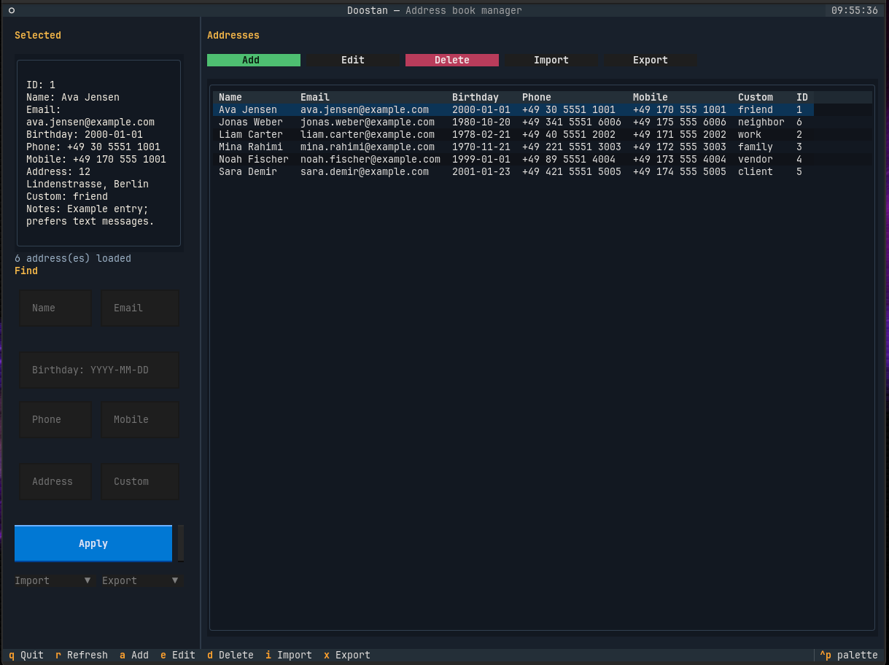

# Doostan

Doostan is a local-first terminal address book built around SQLite
and [Textual](https://textual.textualize.io/). It lets you browse,
search, edit, import, and export contact data without relying on a
cloud sync service.

The name `doostan` is Persian for `friends`.

## What It Does

- Store addresses locally in `~/.doost.db`
- Browse contacts in a keyboard-friendly Textual table
- Search by choosing a field and entering one search value
- Add, edit, and delete addresses from modal forms
- Import and export address data as `html`, `json`, `csv`, or RFC 6350 `vcard`
- Extend file I/O through the plugin registry in
  [`doost/plugins`](doost/plugins)

## Screenshot



## Requirements

- Python `3.14+`
- `pip`

## Installation

Install the project from the repository root:

```bash
python -m pip install .
```

For local development, install it in editable mode and add the
dev tools:

```bash
python -m pip install -e .
python -m pip install -r requirements-dev.txt
```

If you prefer installing only the runtime dependencies without packaging
the project, `requirements.txt` is also available:

```bash
python -m pip install -r requirements.txt
```

## Running Doostan

Launch the application:

```bash
python doostan.py
```

Launch against a custom database path:

```bash
python doostan.py --db-path ~/addresses.db
```

Show the version:

```bash
python doostan.py --version
```

## Main Workflows

- Search addresses by `Full name`, `Email`, `Birthday`, `Phone`,
  `Mobile`, `Address`, or `Custom`
- Apply or clear the current search from the sidebar
- Add, edit, and delete addresses with modal forms
- Import addresses from `html`, `json`, `csv`, or RFC 6350 `vcard`
- Export the current filtered result set to `html`, `json`, `csv`, or RFC 6350 `vcard`
- Navigate from the keyboard with footer key hints

## Keyboard Shortcuts

- `a`: add address
- `e`: edit selected address
- `d`: delete selected address
- `i`: import addresses
- `x`: export current results
- `r`: refresh
- `q`: quit

## Documentation

- General project usage: this `README.md`
- Design and technical notes: [doc/README.md](doc/README.md)

## Development

Run the test suite from the repository root:

```bash
pytest
```

Lint the codebase with Ruff:

```bash
ruff check .
```

## License

This project is licensed under the terms of the [MIT License](LICENSE).
